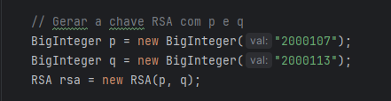
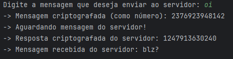
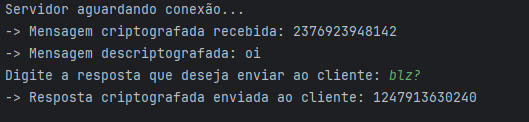

# Criptografia Client-Server com RSA em Java

## Descrição do Projeto
Este projeto implementa um aplicativo Java que trabalha na configuração Client-Server para envio de mensagens criptografadas entre Cliente e Servidor em ambas as direções (Cliente ⇄ Servidor). A comunicação entre eles é feita usando o padrão TCP/IP com Sockets TCP, garantindo uma transmissão de dados segura através da criptografia RSA.

### Objetivo
O objetivo principal é permitir a troca de mensagens criptografadas, utilizando o algoritmo RSA (Rivest-Shamir-Adleman), implementado a partir da escolha de números primos `p` e `q` exclusivos. O projeto aborda as seguintes etapas:

- **Conexão Cliente-Servidor**: Utilizando Sockets TCP.
- **Geração e Troca de Chaves**: As chaves RSA são geradas com base em valores de `p` e `q`, e trocadas entre o Cliente e o Servidor.
- **Criptografia e Descriptografia de Dados**: Mensagens são criptografadas e descriptografadas usando RSA.
- **Desconexão**: Gerenciamento do encerramento seguro da comunicação.

## Estrutura do Projeto
A aplicação foi dividida em diferentes camadas para facilitar a manutenção e a escalabilidade. Abaixo estão os principais componentes:

- **Camada de Conexão**: Gerencia a conexão via Sockets TCP.
  - Arquivo: `ConnectionService.java`
  - Função: Configura a comunicação bidirecional entre o Cliente e o Servidor usando TCP/IP.
  
- **Camada de Criptografia (RSA)**: Implementa o algoritmo RSA.
  - Arquivo: `EncryptService.java`
  - Função: Gerencia a geração de chaves, criptografia e descriptografia das mensagens. 

### Exemplos de Código
#### Conexão Cliente-Servidor
```java
// Exemplo de inicialização de conexão no Servidor
ServerSocket serverSocket = new ServerSocket(1234);
Socket clientSocket = serverSocket.accept(); 
// Aguarda conexão do Cliente
```

### Geração de chaves


### Exemplo de execução do programa com troca de mensagens entre o Cliente e o Servidor:
#### Cliente do Programa


#### Servidor do Programa


# Instalação e Execução Local
 __Requisitos__
- Java 21+
